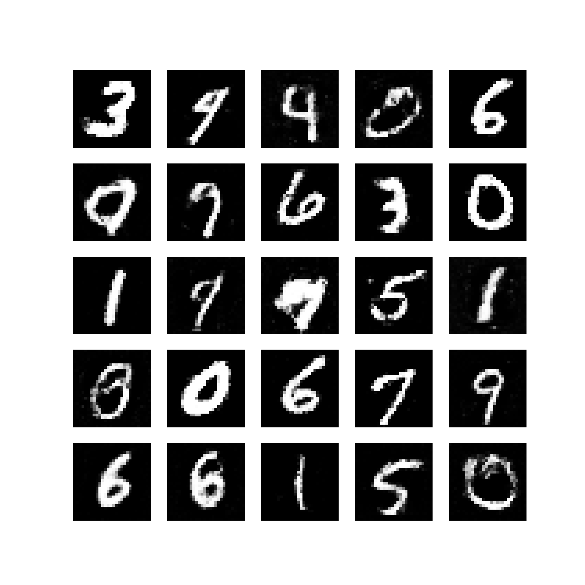

# 🔥 Basic GAN Implementation — MNIST Digit Generator (PyTorch)

<p align="center">
  
</p>
<p align="center"><i>Initial GAN Generated Samples</i></p>

---

## 📌 About the Project

This repository contains a **basic implementation of a Generative Adversarial Network (GAN)** trained on the **MNIST dataset** to generate handwritten digits (0–9) using **PyTorch**.

The image above is the model’s **initial generated output**, stored in the repo.

> I will add all advanced improvements, evaluation metrics, model optimizations, and new features later.

---

## 🚀 Current Implementation

- ✔ Generator & Discriminator networks
- ✔ Training using `BCELoss`
- ✔ Latent noise sampling
- ✔ CPU-compatible basic GAN training
- ✔ Pure implementation using documentation + code (no external AI used in development)

---

## 📦 How to Run

### Clone the repo
```bash
git clone https://github.com/VedantPadole1405/Generative-AI.git
cd Generative-AI
